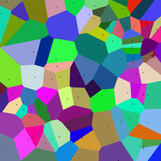

# Диаграммы Вороного

## Теория:
___Диаграмма Вороного___ конечного множества точек ___S___ на плоскости
представляет такое разбиение плоскости, при котором каждая область этого
разбиения образует множество точек, более близких к одному из элементов
множества __S__, чем к любому другому элементу множества.

Ну типа так она выглядит (~~я не математик~~)    

## Алгоритмы:
Есть кароче три варика как эту срань рисовать, точнее три алгоритма.

### В лоб (O(n^4)):

### Алгоритма Двачана (Форчуна):

### Любимая ресрусия:

## Применение
*Блять, это даже не курсач, я просто нахуя-то делаю это, потому что по фану.
Тут будет ебаная выдержка из вики, может по мере роста проекта добавлю отсебятину.
Ну так и быть:*    

Разбиение Вороного применяется в вычислительном материаловедении
для создания синтетических поликристаллических агрегатов. Также используется в
компьютерной графике для случайного разбиения поверхностей (что кстати мне лично
более полезно).

Метод Гольда (или «метод похищения площади») — метод интерполяции функции
в 2D, применяемый, например, в геодезии. Строится диаграмма Вороного всех точек,
после этого к ней добавляется искомая точка. Новая ячейка «отбирает» площадь у
имеющихся; чем больше площади позаимствовано у (xi, yi, zi), тем больше коэффициент
при этой точке.

Также разбиение Вороного применяется при нахождении верхней оценки хроматического
числа для евклидова пространства (*проблема Нелсона-Эрдёша-Хадвигера*)
размерности 2 или 3 (~~вот про эти числа я оч хотел почитать~~).